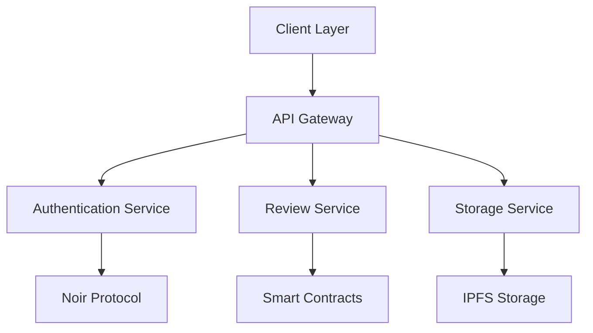

# AnonymousScience 🔬

[](https://opensource.org/licenses/MIT)
[](https://www.typescriptlang.org/)
[](https://nextjs.org/)
[](https://tailwindcss.com/)
[](https://noir-lang.org/)

> Revolutionizing scientific peer review with zero-knowledge proofs and blockchain technology

## 🌟 Overview

AnonymousScience is a groundbreaking platform that transforms the scientific peer review process through cryptographic guarantees of double-blind anonymity while maintaining academic credibility. Our platform leverages cutting-edge zero-knowledge proofs to ensure complete privacy and security in the review process.

### 🎯 Key Features

- **Zero-Knowledge Identity Verification**
  - Cryptographic proof of academic credentials
  - Anonymous yet verifiable expertise
  - Secure institutional email verification

- **Advanced Review System**
  - Double-blind review process
  - Anonymous reviewer matching
  - Quality metrics and feedback

- **Privacy-First Architecture**
  - End-to-end encryption
  - Zero-knowledge proofs
  - Secure data storage

## 🏗️ Architecture



### System Components

1. **Frontend Layer**
   - Next.js application
   - React components
   - Tailwind CSS styling
   - Web3 integration

2. **Backend Services**
   - Authentication service
   - Review management
   - File storage
   - Smart contract integration

3. **Blockchain Layer**
   - Noir protocol integration
   - Smart contracts
   - IPFS storage
   - Zero-knowledge proofs

## 🚀 Getting Started

### Prerequisites

- Node.js (v18 or later)
- npm or yarn
- MetaMask wallet
- Git

### Installation

1. **Clone the Repository**
   ```bash
   git clone https://github.com/yourusername/anonymousscience.git
   cd anonymousscience
   ```

2. **Install Dependencies**
   ```bash
   npm install
   # or
   yarn install
   ```

3. **Environment Setup**
   Create a `.env.local` file:
   ```env
   NEXT_PUBLIC_WALLET_CONNECT_PROJECT_ID=your_project_id
   NEXT_PUBLIC_INFURA_ID=your_infura_id
   NEXT_PUBLIC_ALCHEMY_ID=your_alchemy_id
   ```

4. **Start Development Server**
   ```bash
   npm run dev
   # or
   yarn dev
   ```

5. **Access the Application**
   Open [http://localhost:3000](http://localhost:3000)

## 📚 Documentation

### API Reference

```typescript
interface PaperSubmission {
  title: string;
  abstract: string;
  keywords: string[];
  file: File;
  authorId: string;
}

interface Review {
  paperId: string;
  reviewerId: string;
  score: number;
  comments: string;
  timestamp: number;
}
```

### Smart Contracts

```solidity
contract PaperReview {
    struct Paper {
        string ipfsHash;
        address author;
        uint256 timestamp;
        bool isAnonymized;
    }
    
    function submitPaper(string memory _ipfsHash) public {
        // Implementation
    }
}
```

## 🔧 Development

### Project Structure

```
src/
├── app/                    # Next.js app router
├── components/            # React components
│   ├── layout/           # Layout components
│   ├── ui/              # UI components
│   ├── auth/            # Auth components
│   ├── paper/           # Paper components
│   └── review/          # Review components
├── contracts/           # Smart contracts
├── hooks/              # Custom hooks
├── lib/               # Utility functions
├── styles/           # Global styles
├── types/           # TypeScript types
└── utils/          # Helper functions
```

### Development Workflow

1. **Setup Development Environment**
   ```bash
   # Install dependencies
   npm install

   # Start development server
   npm run dev

   # Run tests
   npm test
   ```

2. **Code Quality Tools**
   ```bash
   # Lint code
   npm run lint

   # Format code
   npm run format

   # Type check
   npm run type-check
   ```

## 🧪 Testing

### Test Categories

1. **Unit Tests**
   - Component testing
   - Hook testing
   - Utility function testing

2. **Integration Tests**
   - API integration
   - Smart contract interaction
   - Authentication flow

3. **End-to-End Tests**
   - User flows
   - Critical paths
   - Edge cases

### Running Tests

```bash
# Run all tests
npm test

# Run specific test suite
npm test -- --testPathPattern=components

# Run with coverage
npm test -- --coverage
```

## 🔐 Security

### Security Measures

1. **Authentication**
   - JWT tokens
   - Zero-knowledge proofs
   - Multi-factor authentication

2. **Data Protection**
   - End-to-end encryption
   - Secure storage
   - Regular audits

3. **Smart Contract Security**
   - Formal verification
   - Audit reports
   - Bug bounties

## 📈 Performance

### Optimization Techniques

1. **Frontend**
   - Code splitting
   - Lazy loading
   - Image optimization

2. **Backend**
   - Caching
   - Load balancing
   - Database optimization

3. **Blockchain**
   - Gas optimization
   - Batch processing
   - Layer 2 solutions

## 🤝 Contributing

### Contribution Guidelines

1. **Fork the Repository**
   ```bash
   git fork https://github.com/yourusername/anonymousscience.git
   ```

2. **Create Feature Branch**
   ```bash
   git checkout -b feature/amazing-feature
   ```

3. **Commit Changes**
   ```bash
   git commit -m 'Add amazing feature'
   ```

4. **Push to Branch**
   ```bash
   git push origin feature/amazing-feature
   ```

5. **Open Pull Request**

### Code of Conduct

Please read our [Code of Conduct](CODE_OF_CONDUCT.md) before contributing.

## 📄 License

This project is licensed under the MIT License - see the [LICENSE](LICENSE) file for details.

## 🌐 Community

### Resources

- [Documentation](https://docs.anonymousscience.com)
- [Discord Server](https://discord.gg/anonymousscience)
- [Blog](https://blog.anonymousscience.com)
- [Twitter](https://twitter.com/anonymousscience)

### Events

- Weekly Development Calls
- Monthly Community Meetups
- Quarterly Hackathons
- Annual Conference

## 🙏 Acknowledgments

- [Noir Protocol](https://noir-lang.org/)
- [RainbowKit](https://www.rainbowkit.com/)
- [Next.js](https://nextjs.org/)
- [Tailwind CSS](https://tailwindcss.com/)

## 📞 Support

For support, email support@anonymousscience.com or join our [Discord community](https://discord.gg/anonymousscience).
